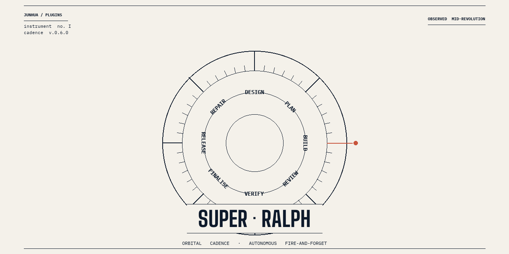

<p align="center">
  
</p>

# Super-Ralph

> **v0.13.0** — Thin commands + modular skills architecture. Nine major commands refactored from 5,635 → 877 lines (84% cut on the refactored slice) by extracting workflow into skills + references. Three new skills (`design-review`, `story-execution`, `release-flow`) and 17 new/expanded reference files in v0.13 (~40 reference files total across the plugin). Every `[STORY]`/`[BE]`/`[FE]`/`[INT]` sub-issue now fits a 200k-token build context via explicit Execution Context Budget enforced at SLICE, story-planner, post-plan audit, and review-design gates. All prior invocations work unchanged — behavior preserved, only the home of the content moved.

Hit enter. Walk away. Come back to results.

## Install

```
/plugin marketplace add junhua/claude-plugins
/plugin install super-ralph@junhua-plugins
```

Then restart Claude Code. See the full command list at [`/super-ralph:help`](./commands/help.md) and the changelog in [CHANGELOG.md](./CHANGELOG.md).

## Dependencies

Super-ralph builds on other plugins. Declared in `plugin.json`:

| Plugin | Required? | Why |
|--------|-----------|-----|
| `ralph-loop` | **required** | Stop hook that drives autonomous iteration |
| `superpowers` | **required** | TDD, debugging, verification, parallel-agents skills |
| `pr-review-toolkit` | optional | code-reviewer, silent-failure-hunter, pr-test-analyzer, type-design-analyzer, code-simplifier, comment-analyzer for `/review-fix` |
| `claude-in-chrome` | optional | browser automation for `/verify` |

## What It Does

Super-ralph orchestrates the full development lifecycle autonomously using a **design-first** pipeline:

1. **Design** — Create implementation-ready epics with Gherkin AC, TDD tasks, FE/BE/INT sub-issues, and execution plans
2. **Build** — Execute stories from issue body directly (TDD tasks are embedded — no separate plan step)
3. **Review & Fix** — Multi-agent code review on branch diff, fix issues until clean, create PR
4. **Verify** — Browser-verify Vercel preview deployments against Gherkin acceptance criteria
5. **Finalise** — Merge PR, close issues, cleanup worktrees
6. **Release** — QA + Codex review + merge staging→main + tag + milestone close

For ad-hoc work ([FIX], [CHORE], spikes), use `/plan` → `/build` instead.

## Release Lifecycle

```
1. Requirements    HoP confirms business requirements (human)
2. Planning        PM uses /design → EPIC + STORYs + [FE]/[BE]/[INT] sub-issues
3a. FE Dev         Design Engineering iterates with PM/HoP (mock data)
3b. BE Dev         Backend/AI built concurrently
3c. Integration    Mock swap + Gherkin E2E + `/super-ralph:verify` (after BE+FE merge)
4. Testing         Playwright e2e + manual verification
5. Release         /release seals and versions
```

## Pipelines

```
Design-first (GitHub):     design → build-story → review-fix → verify → finalise
Design-first (local file): design --local → build-story <path> → review-fix → verify → finalise
Design-adjust:             improve-design → review-design → (re-run build-story for changed stories)
Epic (GitHub):             e2e <epic#> (parallel build-story per story, then release)
Epic (local):              e2e <epic.md> (parallel build-story per story-N, then release)
Ad-hoc:                    plan → build → review-fix → verify → finalise
Reactive:                  repair → review-fix → verify → finalise
Hotfix:                    repair --hotfix → review-fix → verify → finalise on main
Release:                   release (QA → Codex review → merge staging→main → tag)
Quality:                   review-design (validate issues against quality gates)
Brainstorm:                brainstorm (research → CPO+CTO+CAIO → recommendations)
Observability:             status (runtime dashboard) / cleanup (prune stale state)
```

## Issue Taxonomy

```
[EPIC]  → Feature epic with PM Summary + execution plan
  └── [STORY] → User story with Gherkin AC + shared contract
        ├── [BE]  → Backend: schema + service + route + TDD tasks
        ├── [FE]  → Frontend: component + mock data + i18n + TDD tasks + PM checkpoints
        └── [INT] → Integration: mock swap + Gherkin E2E + `/super-ralph:verify`
[FIX]   → Bug fix (use /plan or /repair)
[CHORE] → Technical work (use /plan)
```

## Sub-Agent Architecture (SADD)

`/design` uses **Sub-Agent Driven Development**:

| Phase | Agent | Model | Parallel? |
|-------|-------|-------|-----------|
| 1. Context | Orchestrator reads docs + codebase | Opus | Sequential |
| 2. Research | research-agent + 2 SME brainstormers | Haiku + Sonnet | 3 parallel |
| 3. Epic | Orchestrator defines scope, SLICE decomposition | Opus | Sequential |
| 4. Stories | 1 story-planner per story | Sonnet | Max 4 parallel |
| 5. Issues | Create GitHub issues, set Project #9 fields | Opus | Sequential |
| 6. Review | design-reviewer validates all issues | Sonnet | Sequential |

**Hybrid-mode ralph loops** (`/build --mode hybrid`) additionally dispatch:

| Agent | Role | Model |
|-------|------|-------|
| `spec-reviewer` | Adversarial spec-compliance gate after implementer | Haiku |
| `code-quality-reviewer` | Correctness + readability + testing + security gate | Sonnet |

## Commands

### `/super-ralph:design` — THE PRIMARY COMMAND

Create implementation-ready epics with stories, Gherkin AC, TDD tasks, and FE/BE/INT sub-issues.

```
/super-ralph:design "Admin governance hardening — RBAC, user lifecycle, batch ops"
/super-ralph:design "Finance AP invoices and payment workflow"
/super-ralph:design "Internal spike: log aggregation prototype" --local
```

**What happens:** 6-phase SADD flow — reads product docs + explores codebase, dispatches research + SME agents, applies SLICE decomposition to define stories, dispatches per-story planner agents (Sonnet) that read the codebase and produce exact TDD tasks, creates GitHub issues with Project #9 fields, then self-reviews with `/review-design`.

**`--local` mode (new in v0.11.0):** Writes the entire epic + all `[STORY]`/`[BE]`/`[FE]`/`[INT]` bodies into a single markdown file at `docs/epics/<slug>.md`. Skips GitHub issue creation entirely. Downstream commands operate on the file path instead of issue numbers — useful for iterative design, spikes, and internal work that doesn't belong on the shared roadmap.

**`--brief` mode (new in v0.14.0):** Produce a brief epic (EPIC + STORY skeletons with bulleted AC; no BE/FE/INT sub-issues, no TDD). Use for backlog grooming. Promote individual stories to full via `/super-ralph:expand-story`.

### `/super-ralph:improve-design` — ADJUST EXISTING DESIGN

Make targeted changes to an existing design (local file or GitHub EPIC) from a single prompt.

```
/super-ralph:improve-design "Add a SECURITY scenario to Story 1 of the module catalog epic"
/super-ralph:improve-design "Split Story 5 in docs/epics/2026-04-18-foo.md into list + detail"
/super-ralph:improve-design "Drop Story 3 from epic #531 — out of scope"
```

**What happens:** Autonomously resolves the target epic from the prompt (explicit path/number OR fuzzy match against available epics, with `AskUserQuestion` disambiguation when uncertain). Interprets feedback into structured changes (ADD_STORY / REMOVE_STORY / SPLIT_STORY / MERGE_STORIES / EDIT_AC / EDIT_TDD / EDIT_SHARED_CONTRACT / EDIT_SCOPE / RE_WAVE / EDIT_METADATA). Applies up to 3 edits in parallel. Re-validates via `/review-design`. **Shipped stories are immutable** — refuses edits to COMPLETED stories or CLOSED issues.

### `/super-ralph:review-design` — QUALITY GATE

Validate all issues in an EPIC (or a local epic file) against quality gates before development starts.

```
/super-ralph:review-design 479                                  # Review GitHub EPIC #479
/super-ralph:review-design docs/epics/2026-04-18-foo.md         # Review local epic file
/super-ralph:review-design 479 --fix                            # Auto-fix mechanical issues
/super-ralph:review-design 479 --strict                         # Zero-tolerance mode
```

**What happens:** Fetches EPIC + all child issues, dispatches parallel review agents checking PM gates (persona, outcomes, Gherkin coverage), developer gates (TDD tasks, no pseudocode, exact paths), and cross-issue gates (shared file conflicts, dependency DAG). Returns **READY** / **CONDITIONAL** / **BLOCKED** verdict.

### `/super-ralph:build-story`

Execute a story end-to-end. **Skips plan phase** when TDD tasks are in the issue body (GitHub) or embedded in the epic file (local).

```
/super-ralph:build-story #42                                     # GitHub issue
/super-ralph:build-story docs/epics/foo.md#story-3               # Local epic — single story
/super-ralph:build-story "Add JWT auth endpoints"                # Free-text description
/super-ralph:build-story #42 --skip-verify --skip-finalise
```

Refuses to rebuild stories marked `COMPLETED` in a local epic — shipped work is immutable.

### `/super-ralph:plan` — AD-HOC ONLY

For `[FIX]`, `[CHORE]`, spikes. For epic-driven features, use `/design` instead.

```
/super-ralph:plan "Fix null pointer in policy cascade"
/super-ralph:plan "Upgrade Drizzle ORM to 0.41"
```

### `/super-ralph:brainstorm`

Autonomous brainstorming with CPO/CTO/CAIO perspectives.

```
/super-ralph:brainstorm "Finance module usability"
/super-ralph:brainstorm "What should we build next?" --scope product
```

### `/super-ralph:status` — RUNTIME DASHBOARD

Inspect active ralph-loops, worktrees, open PRs, in-flight epics, stale state.

```
/super-ralph:status              # full dashboard
/super-ralph:status --worktrees  # just worktrees
/super-ralph:status --prs        # just open PRs on super-ralph/* branches
```

### `/super-ralph:cleanup` — PRUNE STALE STATE

Safely remove old worktrees, run directories, and orphan branches.

```
/super-ralph:cleanup                        # interactive, 7-day age default
/super-ralph:cleanup --dry-run              # list only, no delete
/super-ralph:cleanup --age-days 14 --force  # auto-remove items >14 days
```

### `/super-ralph:expand-story`

Promote a brief story (or all brief stories in an epic via `--all`) to full by running the Phase 4 story-planner. Creates the `[BE]`/`[FE]`/`[INT]` sub-issues and replaces bulleted AC with full Gherkin.

```
/super-ralph:expand-story docs/epics/2026-04-19-knowledge-refresh.md#story-3
/super-ralph:expand-story #531
/super-ralph:expand-story docs/epics/2026-04-19-knowledge-refresh.md --all
```

### Other Commands

| Command | Purpose |
|---------|---------|
| `/super-ralph:build` | Execute a plan via ralph-loop |
| `/super-ralph:repair` | Domain-aware reactive fix (supports `--hotfix`) |
| `/super-ralph:review-fix` | Multi-agent code review + fix loop |
| `/super-ralph:verify` | Browser-verify PR against acceptance criteria |
| `/super-ralph:finalise` | Merge PR, close issues, cleanup |
| `/super-ralph:e2e` | Execute entire epic with wave parallelism |
| `/super-ralph:release` | Promote staging → main with QA gate |
| `/super-ralph:init` | Generate `.claude/super-ralph-config.md` |
| `/super-ralph:help` | Show full documentation |

## Brief Design Flow

For backlog grooming and sprint prep, run `/super-ralph:design` with `--brief`:

```
# Local brief (everything in a single markdown file)
/super-ralph:design --local --brief "Phase 3 knowledge refresh"

# GitHub brief (EPIC + STORY issues on GitHub, with `brief` label)
/super-ralph:design --brief "Phase 3 knowledge refresh"
```

Brief stories have bulleted `[HAPPY]`/`[EDGE]`/`[SECURITY]` AC — no shared contract, no TDD. When a brief story is ready to build, promote it:

```
/super-ralph:expand-story docs/epics/2026-04-19-knowledge-refresh.md#story-3
# or on GitHub:
/super-ralph:expand-story #531
```

`/super-ralph:improve-design` works on both brief and full stories; it routes per-story and refuses `EDIT_TDD`/`EDIT_SHARED_CONTRACT` on brief stories (with a helpful pointer to `/expand-story`).

`/super-ralph:review-design` applies lite `BRIEF-G1..G3` gates on brief stories and full gates on expanded ones. A pure brief epic yields verdict `READY FOR EXPAND` instead of `READY`.

## Run State Durability

Per-run state (context, progress, phase outputs) lives in:

```
.claude/runs/<kind>-<id>/         ← preferred: durable, survives reboots
/tmp/super-ralph-<kind>-<id>/     ← legacy fallback for sandboxed envs
```

Resume detection reads both locations. `/super-ralph:status` surfaces the active runs and `/super-ralph:cleanup` prunes stale ones.

## SLICE Decomposition

Before writing any story, `/design` applies SLICE:

| Letter | Check | Split if... |
|--------|-------|-------------|
| **S** | System boundary | BE+FE in one action = OK |
| **L** | Lifecycle stage | Multiple CRUD ops → separate stories |
| **I** | Interaction type | List/detail/form/action → separate stories |
| **C** | Config vs operation | Admin ≠ operator |
| **E** | Error surface | >3 error modes → split error story |

Additional rules: one schema migration = one story, one state machine = one story, list ≠ detail, XL = must split. Target 8-15 stories per epic.

## FE/BE Concurrent Development

```
[STORY] — Shared contract (TS types) + Gherkin AC
  ├── [BE] — Schema + service + route + TDD tasks
  └── [FE] — Component + mock data + i18n + PM checkpoints + TDD tasks

FE iterates with PM using mock data:
  CP1 (shell) → CP2 (happy path) → CP3 (edges) → CP4 (PM sign-off)

Integration: swap mocks for real API → run e2e tests
```

## AI-Readable Documentation Standard

| Rule | Bad | Good |
|------|-----|------|
| Tables over prose | "The slice includes..." | Vertical Slice table |
| Expected output | `Run: bun test` | `Run: bun test foo.test.ts` / `Expected: PASS — 2 passed` |
| Concrete values | "appropriate error" | `"Vendor is required"` |
| Decisions pre-made | "Choose between..." | "Use JWT. See auth.ts." |
| No filler | "This is important..." | `**Required for:** Task N+1` |

## Gherkin Format

All stories use full Gherkin with category labels:

```gherkin
Feature: Pipeline Board
  Background:
    Given I am logged in as sales manager

  Scenario: [HAPPY] View pipeline with deals
    Given deals exist in "Qualification" and "Proposal"
    When I navigate to /sales/pipeline
    Then I see 2 stage columns with correct deal counts

  Scenario: [EDGE] Empty pipeline
    Given no deals exist
    When I navigate to /sales/pipeline
    Then I see empty state with "Create your first deal" prompt
```

Mapping: Feature→`describe()`, Background→`beforeEach()`, Scenario→`test()`, Outline→`test.each()`

## Plugin Structure

```
super-ralph/
├── .claude-plugin/plugin.json   ← version, dependencies
├── CHANGELOG.md                 ← version history
├── agents/                      ← subagents dispatched via Task tool
│   ├── browser-verifier.md
│   ├── code-quality-reviewer.md
│   ├── issue-fixer.md
│   ├── plan-reviewer.md
│   ├── research-agent.md
│   ├── sme-brainstormer.md
│   └── spec-reviewer.md
├── commands/                    ← v0.13: thin orchestrators (most ≤100 lines)
│   ├── brainstorm.md            ← 55 lines
│   ├── build-story.md           ← 69 lines — 5-phase state machine
│   ├── build.md                 ← 49 lines (exemplar thin shim)
│   ├── cleanup.md
│   ├── design.md                ← 100 lines — PRIMARY COMMAND (6-phase SADD)
│   ├── e2e.md                   ← 85 lines — wave-driven epic orchestrator
│   ├── finalise.md              ← 54 lines
│   ├── help.md
│   ├── improve-design.md
│   ├── init.md
│   ├── plan.md                  ← AD-HOC ONLY ([FIX]/[CHORE]/spikes)
│   ├── release.md               ← 75 lines
│   ├── repair.md                ← 68 lines
│   ├── review-design.md         ← 64 lines — quality gate
│   ├── review-fix.md            ← intentionally command-only
│   ├── status.md
│   └── verify.md
├── scripts/
│   ├── setup-ralph-loop.sh
│   └── parse-local-epic.sh
└── skills/                      ← v0.13: lean SKILL.md + rich references
    ├── browser-verification/    ← + smoke-test-checklist.md
    ├── build/                   ← + build-executor.md
    ├── deployment-verification/ ← canonical CD health check
    ├── design-review/           ← NEW v0.13: + gate-catalog.md
    ├── issue-management/        ← taxonomy + gh-invocation-patterns.md
    ├── product-brainstorm/      ← + brainstorm-flow.md, executive-personas.md
    ├── product-design/          ← navigator + sadd-workflow, story-planner-spec,
    │                               execution-planning, context-budget references
    ├── ralph-planning/          ← canonical autonomous-decision-pattern
    ├── release-flow/            ← NEW v0.13: + finalise-flow.md, release-flow.md
    ├── repair-domains/          ← + repair-flow.md, hotfix-backport.md, domain-patterns.md
    ├── review-fix-loop/         ← DO_NOT_ADD_SKILL (command-only by design)
    └── story-execution/         ← NEW v0.13: 5-phase state machine + 7 references
```

## What's New in v0.13.0

**Thin commands + modular skills architecture.** Nine major commands refactored into thin orchestrators; three new skills created; 17 new/expanded reference files in v0.13 (~40 total across the plugin). See [CHANGELOG.md](./CHANGELOG.md) for full details.

- **Nine commands slimmed**: design (1,313→100), build-story (931→69), review-design (624→64), repair (606→68), e2e (580→85), release (547→75), finalise (435→54), brainstorm (299→55), improve-design (300→307, added skill pointers). **Total 5,635 → 877 lines (84% cut.)**
- **Three new skills**:
  - `design-review` — canonical gate catalog (STORY-G / BE-G / FE-G / INT-G / CTX-G / CX-x) used by `/review-design`
  - `story-execution` — 5-phase state machine (plan → build → review-fix → verify → finalise) used by `/build-story`; epic-orchestration.md backs `/e2e`
  - `release-flow` — unified per-story finalise (Flow A) + release promotion (Flow B) used by `/finalise` and `/release`
- **Execution Context Budget** enforced end-to-end in `/design`: SLICE-time pre-estimation → in-prompt HARD CONSTRAINT on story-planner → `SPLIT_NEEDED` sentinel protocol → Step 10.5 post-plan byte audit → CTX-G1..G3 gates at `/review-design`. Every `[STORY]`/`[BE]`/`[FE]`/`[INT]` body sized to fit the downstream 200k-token build subagent context, so oversized stories fail at design time instead of at build time.
- **Architecture ratio**: commands : (skills + references) ≈ **1 : 7** on refactored slice, **~1 : 3 plugin-wide** — past the "thin commands + lean skills + rich references" best-practice target.

## What's New in v0.11.0

Local mode + autonomous design adjustment — `/design --local` writes the entire epic into a single `docs/epics/<slug>.md` file, `/super-ralph:improve-design "<prompt>"` applies targeted adjustments, all downstream commands accept path-based arguments. See [CHANGELOG.md](./CHANGELOG.md).

## What's New in v0.9.2 – v0.10.0

- **v0.10.0**: `[INT]` sub-issue type for integration + E2E + deployment verification; 9 enforcement gates in `/review-design`.
- **v0.9.2**: Portability (`${CLAUDE_PLUGIN_ROOT}`), quality-gate agents, durable `.claude/runs/`, `/status`, `/cleanup`, `deployment-verification` skill, plugin dependencies.

## License

MIT
